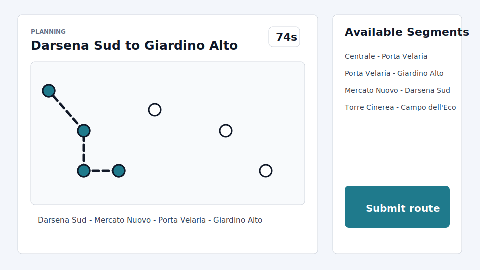

# Exam #1: "Last Race"
## Student: Berke Sayicioglu

## React Client Application Routes

- Route `/`: single page application for anonymous instructions/ranking, authenticated setup, planning, execution result, and logout.

## API Server

- GET `/api/session`
  - returns the current authenticated user, if any.
- POST `/api/sessions`
  - body: `{ "email": "...", "password": "..." }`
  - authenticates with Passport local strategy and starts a session cookie.
- DELETE `/api/sessions/current`
  - logs out the current user.
- GET `/api/instructions`
  - returns the public game title and summary.
- GET `/api/ranking`
  - returns the general ranking with each user's best valid score.
- GET `/api/network`
  - authenticated; returns lines, stations, and connections for setup.
- POST `/api/games`
  - authenticated; creates a new game with random reachable start/destination stations and returns the planning data.
- POST `/api/games/:id/submit`
  - authenticated; body: `{ "route": [stationId, ...] }`
  - validates the route, executes random events for each segment, stores the result, and returns score/log.
- GET `/api/me/games`
  - authenticated; returns submitted games for the current user.

## Database Tables

- Table `users` - registered users with email, display name, salt, and encrypted password hash.
- Table `lines` - metro line names and colors.
- Table `stations` - station names, map coordinates, and interchange flag.
- Table `connections` - station pairs belonging to a metro line.
- Table `events` - journey event descriptions and coin effects.
- Table `games` - started/submitted games, route JSON, validity, score, and event log.

## Main React Components

- `App` (in `App.jsx`): owns session state and switches between anonymous, setup, and game views.
- `Login` (in `App.jsx`): controlled login form using the session API.
- `StationMap` (in `App.jsx`): SVG underground map used in setup and route planning.
- `Game` (in `App.jsx`): 90-second planning phase, route builder, submit flow, and execution result.
- `Ranking` (in `App.jsx`): public general ranking.

## Screenshots

## Users Credentials

- alice@student.test, alice
- berke@student.test, berke
- marta@student.test, marta

## Use of AI Tools

AI assistance was used to interpret the assignment PDF, implement the React/Express/SQLite application, and debug build/API issues. The generated output was adapted to this repository and verified with `npm run lint`, `npm run build`, server startup, and HTTP smoke tests for login, network retrieval, game creation, invalid route rejection, and valid route scoring.
